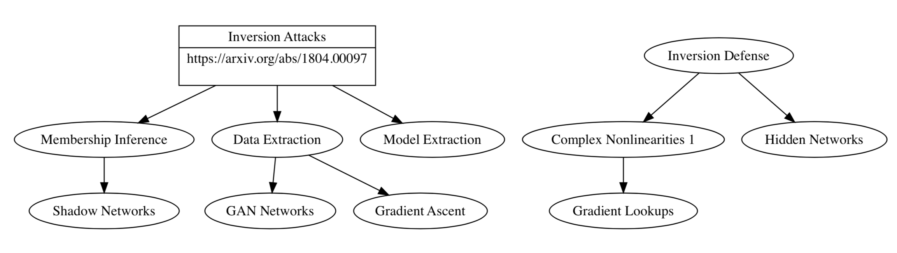
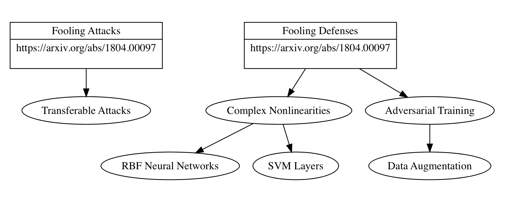

# CypherCat

Here are tools and software you can use to replicate our work.

## Research

We are focusing on two different areas of research:
- *Model inversion* attack is the process of either the model parameters or the data used to train the data.
- *Adversarial Attacks and Defense*: an adversary makes small perturbations to an input image which can cause a classifier to produce the wrong label.

The below is created by our visualization software. The actual PDF has links to the arxiv papers. For inverting neural networks, the following wording is of relevance:
[](Visualizations/inversion_defense.gv.pdf)
For fooling neural networks, this is the following papers and relevant work:
[](Visualizations/inversion_attack.gv.pdf)

## Environment and Software

### Setup
```console
$ git clone https://github.com/Lab41/cyphercat.git
$ cd cyphercat
$ virtualenv cyphercat_virtualenv
$ source cyphercat_virtualenv/bin/activate
$ pip install -r requirements.txt
$ ipython kernel install --user --name=cyphercat_virtualenv
```
Select `cyphercat_virtualenv` kernel when running Jupyter.  

### Structure
[Attack_baselines/](Attack_baselines/) - Baselines for various attack types.   

[Classification_baselines/](Classification_baselines/) - Baselines for various model architectures on popular datasets.   

[Utils/](Utils/) - Contains model definitions, training and evaluation scripts.   

[Visualizations/](Visualizations/) - Scripts for generating taxonomy graphs.   

### Visualization

We are using [GraphViz](https://www.graphviz.org/) for our research in order to get a handle on the papers in the space, as well as describe our research. You can view some of that here. To install visualization tools via Mac, use:

```
brew install graphviz
pip install graphviz
```

## References
1. Salem, Ahmed, et al. "ML-Leaks: Model and Data Independent Membership Inference Attacks and Defenses on Machine Learning Models." arXiv preprint arXiv:1806.01246 (2018). [Link](https://arxiv.org/abs/1806.01246)  
