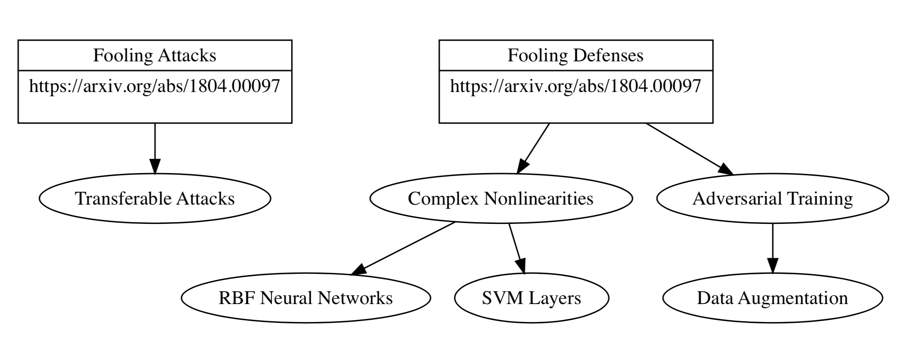

# CypherCat

Here are tools and software you can use to replicate our work.

## Environment and Software

### Visualization

We are using [GraphViz](https://www.graphviz.org/) for our research in order to get a handle on the papers in the space, as well as describe our research. You can view some of that here.



To install via Mac, use:

```
brew install graphviz
pip install graphviz
```
