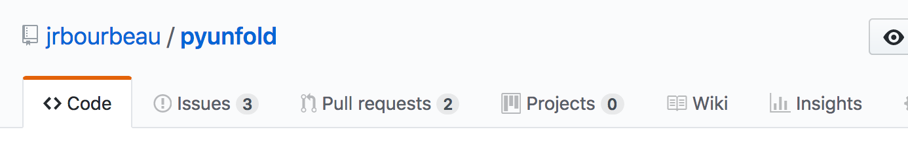
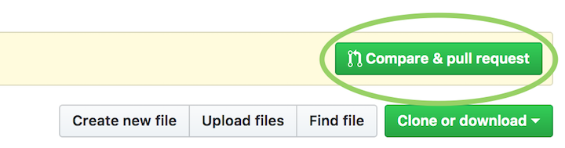

.. _contributing:

:github_url: https://github.com/Lab41/cyphercat

************
Contributing
************

CypherCat is an open-source project and contributions are always welcome from anyone. Feel free to open a pull request on `GitHub <https://github.com/Lab41/cyphercat>`_ or file a new feature request or bug report on our `issue tracker <https://github.com/Lab41/cyphercat/issues>`_.

==================
Contributing guide
==================

If you are new to working with forks, check out `GitHub's working with forks article <https://help.github.com/articles/working-with-forks/>`_.

Step 1: Creating a new issue
============================

- If you don't already have a `GitHub <http://www.github.com>`_ account, create one
- Go to the `CypherCat GitHub page <https://github.com/Lab41/cyphercat>`_ and create a new issue by clicking on the "Issues" tab and then the "New issue" button

Step 2: Forking the repository
==============================

(If you have an existing configured fork of CypherCat, you can skip to Step 4: Syncing an existing fork)

- From the CypherCat repository use the "Fork" button to fork the project into your GitHub account

- This forked copy of CypherCat can now be cloned to your local machine using

.. code-block:: bash

    $ git clone https://github.com/<your_username>/cyphercat.git

Step 3: Configuring a remote for a fork
=======================================

From your cloned copy of CypherCat from the previous step, list the existing remotes with

.. code-block:: bash

    $ cd cyphercat
    $ git remote -v

You'll most likely see something like

.. code-block:: bash

    origin  https://github.com/<your_username>/cyphercat.git (fetch)
    origin  https://github.com/<your_username>/cyphercat.git (push)

To add the original CypherCat project repository as a remote (named "upstream") to your copy of CypherCat via

.. code-block:: bash

    $ git remote add upstream https://github.com/Lab41/cyphercat.git

Now when you execute ``git remote -v``, the newly added upstream remote should be present

.. code-block:: bash

    origin  https://github.com/<your_username>/cyphercat.git (fetch)
    origin  https://github.com/<your_username>/cyphercat.git (push)
    upstream        https://github.com/Lab41/cyphercat.git (fetch)
    upstream        https://github.com/Lab41/cyphercat.git (push)

Step 4: Syncing an existing fork
================================

To ensure that your existing fork is up-to-date with the original CypherCat repository, fetch the upstream commits via

.. code-block:: bash

    $ git fetch upstream

The output should look something like

.. code-block:: bash

    remote: Counting objects: xx, done.
    remote: Compressing objects: 100% (xx/xx), done.
    remote: Total xx (delta xx), reused xx (delta x)
    Unpacking objects: 100% (xx/xx), done.
    From https://github.com/Lab41/cyphercat
     * [new branch]      master     -> upstream/master

Now the commits to the master branch of Lab41/cyphercat are stored in your local upstream/master branch. At this point, you'll want to make sure (if you're not already) that you're on the master branch of your local repository

.. code-block:: bash

    $ git checkout master
    Switched to branch 'master'

Now you can merge the upstream/master branch into your master branch with

.. code-block:: bash

    $ git merge upstream/master

Now the master branch of your local copy of CypherCat should be up-to-date with the original CypherCat master branch!

Step 5: Create a new feature branch
===================================

Next, create a new branch for the feature you would like to develop with

.. code-block:: bash

    $ git checkout -b <new_feature_branch_name>

The output should be

.. code-block:: bash

    Switched to branch '<new_feature_branch_name>'

Step 6: Install local copy of CypherCat
======================================

Next, you'll want to make sure that Python imports your local version of CypherCat. This can be done by ``pip`` installing your local CypherCat repository in `editable mode <https://pip.pypa.io/en/stable/reference/pip_install/#editable-installs>`_

.. code-block:: bash

    $ pip install -e .

To install additional development dependencies for running tests and building the documentation, instead run

.. code-block:: bash

    $ pip install -e .[dev]

Note that if you previously had CypherCat installed in your environment to ``pip uninstall cyphercat`` before executing the previous command.

Step 7: Develop new code!
=========================

Now add your feature, bug fix, typo fix, etc.

Step 8: Running tests with the new code
=======================================

Once your contributions have been added, you'll want to run the tests for this project to ensure that none of the new code breaks any existing tests. Tests can be run by going to the root directory of your cyphercat repository and executing

.. code-block:: bash

    pytest cyphercat

To run with code coverage use ``pytest --cov cyphercat``

Step 9: Documentation
=====================

If necessary for your contribution, add the appropriate documentation to the files in the ``docs/source/`` directory. The documentation can then be build via

.. code-block:: bash

    cd docs
    make html

The built documentation will be placed in the ``_build/html`` directory.

Step 10: Committing and uploading changes
=========================================

Now the changes you've made are ready to be committed and uploaded to GitHub. Let git know which files you would like to include in your commit via

.. code-block:: bash

    $ git add <modifies_files_here>

and then commit your changes with

.. code-block:: bash

    $ git commit -m '<meaningful messages about the changes made>'

Now you can push this commit from your local repository to your copy on GitHub

.. code-block:: bash

    $ git push origin <new_feature_branch_name>

Step 11: Submitting a pull request
==================================

Finally, you can go to your copy of CypherCat on GitHub and submit a pull
request by clicking the "Compare & pull request" button!

If you're new to writing pull requests, see GitHub's `How to write the perfect
pull request <https://blog.github.com/2015-01-21-how-to-write-the-perfect-pull-request/>`_
article for a list of some best practices.

